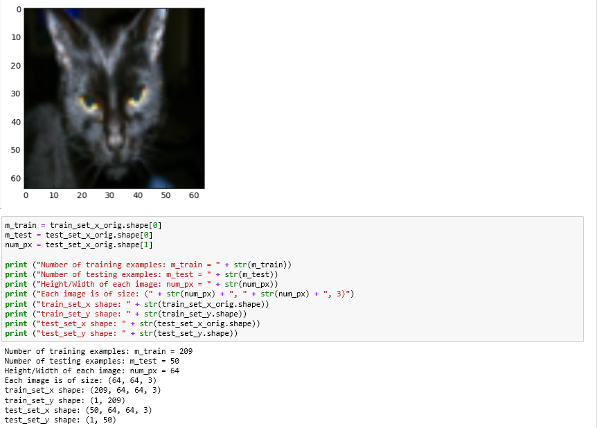
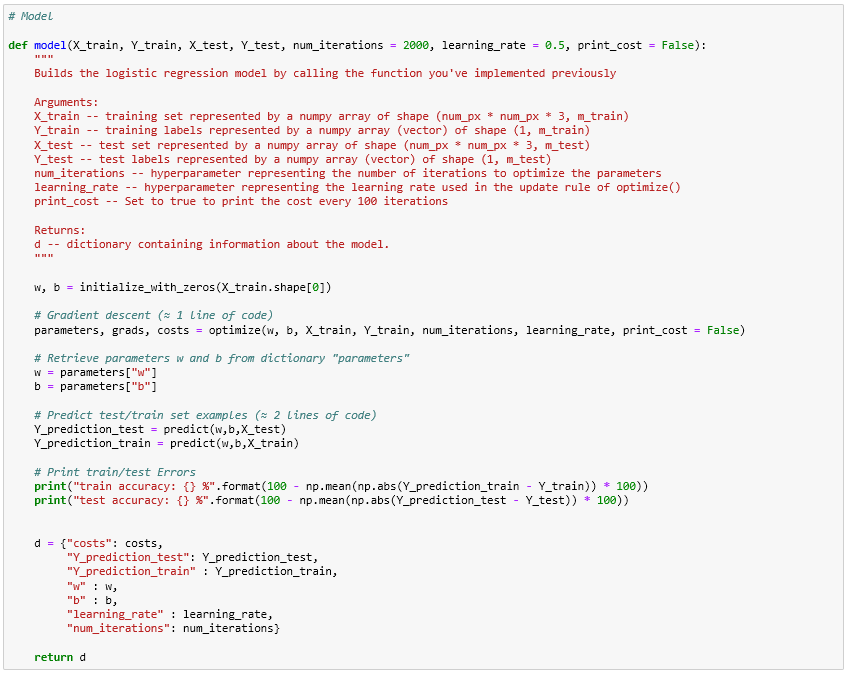

# Cat vs Non-Cat Classification

## Introduction
Classification of "Cat vs non-Cat" dataset using Deep neural networks.
Compared to simple logistic regression, the DNN yields better classification accuracy.
Performance of 70% with logistic regression, 72% with 2 layers, and 80% with a 4 layer network without tuning.

## Outcomes

